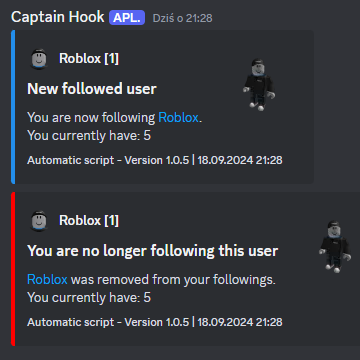

*Program version:* 1.0.7

# Description:
**Roblox User Relationships Logger** is a simple Python program designed to monitor and manage changes in a specified Roblox account's relationships. This program tracks multiple types of user relationships, including::

- **Friends**: Monitors changes in the user's friends list.
- **Followers**: Tracks new and removed followers.
- **Followings**: Keeps an eye on the users you follow.

The script interacts with the Roblox API to fetch current relationship data and compares it with a locally stored list. When changes occur, such as new friends, followers, or followings, or if someone is removed, the script sends notifications via Discord and/or Guilded webhooks. Notifications include details such as usernames, avatar URLs, and counts of various relationships, providing a comprehensive view of your Roblox connections.

**Key Features:**
- **Configurable Notifications**: Customize the notification settings to suit your needs.
- **Multi-Platform Support**: Designed to run on both Windows and Linux systems (tested on Ubuntu 23.04).
- **Automatic Operation**: Can be scheduled to run automatically using Windows Task Scheduler or similar scheduling tools on Linux.

### Roblox API Documentation

- **Thumbnails API Documentation**: [https://thumbnails.roblox.com/docs/index.html](https://thumbnails.roblox.com//docs/index.html) – for fetching avatar and headshot images.
- **Friends API Documentation**: [https://friends.roblox.com/docs/index.html](https://friends.roblox.com//docs/index.html) – for fetching relationship data.

# Setup

To set up the Roblox User Relationships Logger, follow these steps:

1. **Clone or Download the Repository**
   - All necessary files, including a default configuration file, are included in the repository. Clone or download the repository to your local machine.

2. **Configure the Script**
   - Open the `config.json` file located in the root directory of the repository.
   - Update the configuration file with your specific details. Use the following template:

     ```json
      {
          "discord_webhook_url": "Your_Discord_URL",
          "guilded_webhook_url": "Your_Guilded_URL",
          "relationshipType": "friends",
          "Your_User_ID": 1
          "send_discord_log": true,
          "send_guilded_log": true,
          "send_new_entries": true,
          "send_removed_entries": false,
          "embed_wait_HTTP": 1.0
      }
     ```

   - **Fields Explanation**:
     - `discord_webhook_url`: Your Discord webhook URL for sending notifications.
     - `guilded_webhook_url`: Your Guilded webhook URL for sending notifications.
     - `relationshipType`: Type of relationship to track:
       - `"friends"`: Monitors changes in the friends list.
       - `"followers"`: Tracks new and removed followers.
       - `"followings"`: Tracks changes in the followings list.
     - `Your_User_ID`: Your Roblox User ID.
     - `send_discord_log`: Set to `true` to send logs to Discord.
     - `send_guilded_log`: Set to `true` to send logs to Guilded.
     - `send_new_entries`: Set to `true` to receive notifications for new entries.
     - `send_removed_entries`: Set to `true` to receive notifications for removed entries.
     - `embed_wait_HTTP`: Time to wait between HTTP requests (in seconds).

3. **Install Dependencies**
   - Ensure you have Python 3.11 installed.
   - Install the required `requests` library by running:
     ```bash
     pip install requests
     ```

4. **Run the Script**
   - Execute the script using Python:
     ```bash
     python Main.py
     ```

5. **Schedule the Script**
   - On Windows, use Task Scheduler to run the script at regular intervals.
   - On Linux, you can use `cron` jobs to schedule the script.

# Examples:





